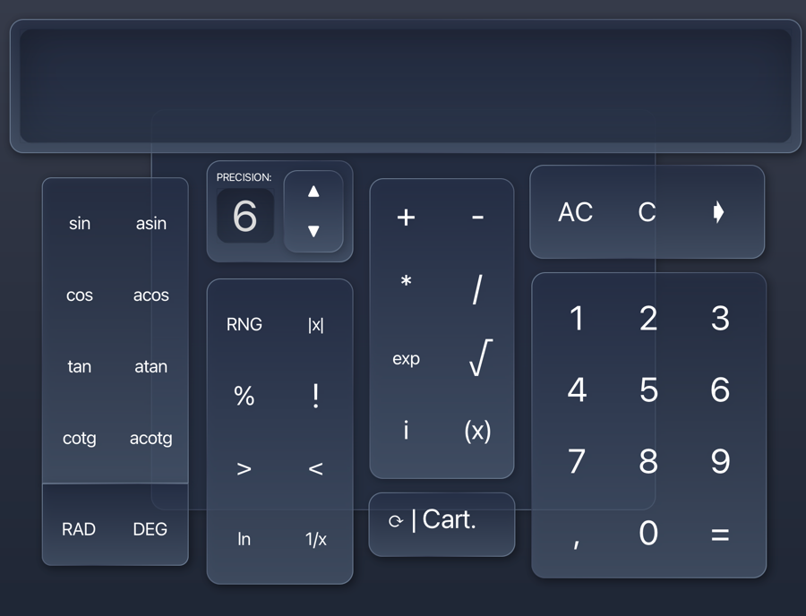

Code quality: 
[](https://app.codacy.com/gh/NoFOUC/calculator-cucumber/dashboard?utm_source=gh&utm_medium=referral&utm_content=&utm_campaign=Badge_grade)
[](https://sonarcloud.io/project/overview?id=NoFOUC_calculator-cucumber)

Test coverage: 


# Calculator Cucumber by Noa Foucoux, Maksym Iakovenko, Loic Dupont et Virgil Surin 



## How to use the calculator

All The instructions below are for the command line but they are also available for the IDE by adding these commands 
in the run configuration of the IDE.
If you use IntelliJ, an environment is already set up for you. You juste need to choose what you want. 
(explain on the video)


On the command line, you just need to run the following command:

```sh
mvn clean
```

for cleaning the project, then

```sh
mvn compile
```

to compile the project, and finally

```sh
mvn exec:java
```

Then, you can enter your expression by clicking on the button of the calculator with your mouse.

## How to test the calculator

On the command line, you just need to run the following command:

```sh
mvn clean
```

for cleaning the project, then

```sh
mvn test
```

to test all the unit test of the project corresponding to the code coverage of jacoco badge above. 

### Test GUI

We also have implemented some GUI test using the library TestFX. To run them, you just have to accept your terminal/IDE
to control your computer because TextFx use a bot to control and test the input. 
On Mac Os, you have to go to System Preferences > Security & Privacy > Privacy > Accessibility and 
add your terminal or IDE to the list.
Then, on the command line, you just need to run the following command:

```sh
mvn clean
```

for cleaning the project, then

```sh
mvn test -P GUI
```

The GUI test are include in the jacoco report on your computer in the folder target/site/jacoco/index.html.
Unfortunately, the GUI test are not include in the jacoco badge above because we were not able to test the GUI 
with GitHub Actions.


## How to generate the javadoc

On the command line, you just need to run the following command:

```sh
mvn javadoc:javadoc
```

Then, you can find the javadoc in the folder target/site/apidocs/index.html.

## How to generate the jar file

On the command line, you just need to run the following command:

```sh
mvn clean
```

for cleaning the project, then

```sh
mvn install
```

Then, you can find the jar file in the folder target/calculator-cucumber-0.5.0-jar-with-dependencies.jar

## Branches coverage explanation

As you can see from the badge above, our branch coverage is only 72.2%. 
I talked to Mr. Mens about this because, based on how branch coverage is calculated, 
it is mainly useful for projects where each branch is continuously used. 
In our case, our low branch coverage is due to the fact that after creating our personal extensions, 
we merge them all into the main branch and no longer use the extension branches. 
These branches are only for the evaluation of our personal extensions, so branch coverage is not relevant for us.


# Original README
## Calculating arithmetic expressions

### About

This repository contains Java 17 code for computing arithmetic expressions. It is deliberately incomplete as it serves to be the basis of all kinds of extensions, such as a more sophisticated Calculator application. The code was written to be used for educational purposes at the University of Mons, Belgium in the context of the software evolution course.


#### Unit testing and BDD

*  All tests can be found in the src\test directory. They serve as executable documentation of the source code.
*  The source code is accompanied by a set of JUnit 5 unit tests. These tests can be written and run in the usual way. If you are not familiar with unit testing or JUnit 5, please refer to https://junit.org/junit5/.
*  The source code is accompanied by a set of Cucumber BDD scenarios, also running in Junit. If you are not familiar with Cucumber and BDD, please refer to https://cucumber.io/docs/cucumber/.
The BDD scenarios are specified as .feature files in the src\test\resources directory. Some classes defined in src\test take care of converting these scenarios to executable JUnit tests.

#### Prerequisites

*  You will need to have a running version of Java 17 on your machine in order to be able to compile and execute this code.
*  You will also need to have a running version of Maven, since this project is accompanied by a pom.xml file so that it can be installed, compiled, tested and run using Maven.

#### Installation and testing instructions

*  Upon first use of the code in this repository, you will need to run "mvn install" to ensure that all required project dependencies (e.g. for Java, JUnit, Cucumber, and Maven) will be downloaded and installed locally.
*  Assuming you have a sufficiently recent version of Maven installed (the required versions are specified as properties in the POM file), you can compile the source code using "mvn compile"
*  Once the code is compiled, you can execute the main class of the Java code using "mvn exec:java" 
*  The tests and BDD scenarios are executable with Maven using "mvn test"
*  Note that the tests are also executed when you do a "mvn install". It is possible to skip those tests by providing an extra parameter. For details of more advanced uses of Maven, please refer to its official documentation https://maven.apache.org/guides/.

#### Test coverage and JavaDoc reporting

*  In addition to testing the code, "mvn test" will also generate a test coverage report (in HTML format) using JaCoCo. This test coverage is generated in target/site/jacoco.
*  When packaging the code using "mvn package" the JavaDoc code documentation will be generated and stored in target/site/apidocs.

### Built With

*  [Maven](https://maen.apache.org/) - an open source build automation and dependency management tool
*  [JUnit5](https://junit.org/junit5/) - a unit testing framework for Java
*  [Cucumber](https://cucumber.io/docs/cucumber/) - a tool for Behaviour-Driven Development
*  [JaCoCo](https://www.jacoco.org) - a code coverage library for Java
*  [JavaDoc](https://docs.oracle.com/en/java/javase/17/javadoc/javadoc.html) - a code documentation tool for Java

### Versioning

We use [SemVer](http://semver.org/) for versioning. For the versions available, see the [tags on this repository](https://github.com/tommens/calculator-cucumber/tags). 

### Contributors

* Tom Mens
* Gauvain Devillez @GauvainD
* Damien Legay @DamienLegay

### Licence

This code is licensed as CC BY-SA 4.0 (Creative Commons Attribution-ShareAlike 4.0 International)
https://creativecommons.org/licenses/by-sa/4.0/

### Acknowledgments

* Software Engineering Lab, Faculty of Sciences, University of Mons, Belgium.
